## How to Run This Project

1. **Navigate to the Frontend Folder**: Make sure you run this project in `frontend` folder. If not, open your terminal and navigate to the `frontend` folder.
    ```sh
    cd frontend
    ```

2. **Install Dependencies**: Run the following command to install all necessary dependencies. Please install `NodeJs` if you didn't do it before.
    ```sh
    npm install
    ```

3. **Run the Development Server**: This project is built with `Vite` and `React` instead of `Create-React-App`. Therefore, use the following command to start the development server.
    ```sh
    npm run dev
    ```

4. **Open the Project in Your Browser**: After running the development server, open your browser and go to:
    ```
    http://localhost:5173
    ```

## Website Workflow

**Note**: 
1. For Assignment 1, only 10 valid accounts are usable. You can access the list of these accounts in folder `src/data` and feel free to try any accounts you want. However, as we can only hard code the sample data for this assignment, it's impossible and unnessary for us to write list of transactions and history purchases for each account. Therefore, we strongly suggest you use 2 accounts: `0xf39Fd6e51aad88F6F4ce6aB8827279cffFb92266` and `0x70997970C51812dc3A010C7d01b50e0d17dc79C8` for your testing and marking. These 2 accounts come with a hardcode transaction history data that represent the real life transaction of an NFT marketplace. Please note that other accounts are not wrong, they still operate fully but they just don't have much data and can make your marking quite boring.

2. The data in this is hardcode, and stored in `SessionStorage` during operation. That means when you close the website, any new purchases you made will not be stored, and the website will return to the initial state. This will be improved in Assignment 2, when we are able to write backend code and use database.

### 1. Connect Wallet
1. **Open the Website**: Navigate to `http://localhost:5173`.
2. **Connect Wallet**: Click on the "Connect Wallet" button located at the top right corner of the page.
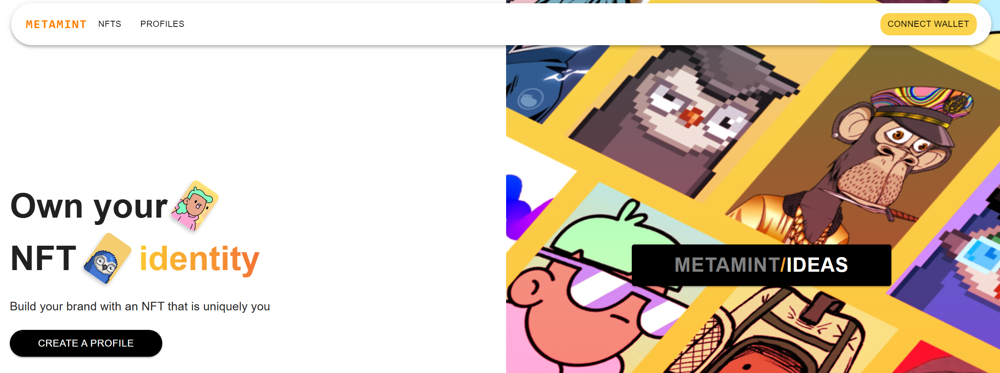
3. **Select Wallet**: A tooltip will appeared with an input field for you to enter the address of a valid account. Please use 1 of 10 valid accounts, other invalid data did not work.
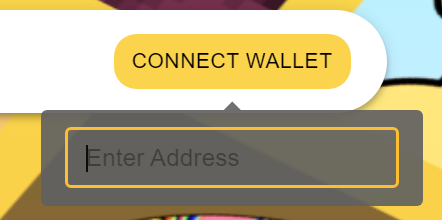
4. **Connect successfully**: If you enter a valid account, your address will appear in correct format. If you want to change account, please repeat the process.
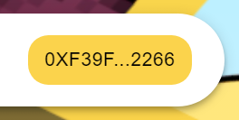

### 2. Make a Bid
1. **Browse NFTs**: Navigate to the marketplace page to view available NFTs.
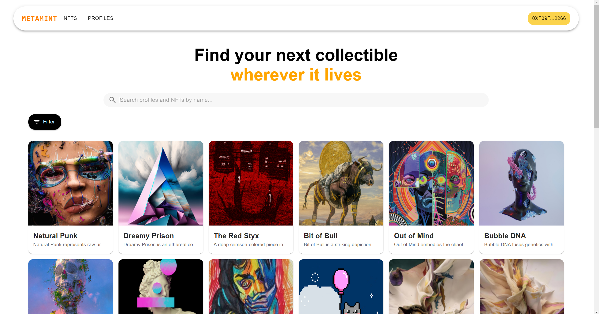
2. **Search and Filter**: You can search for the name of Nft you want or filter based on base price, tags or minted date
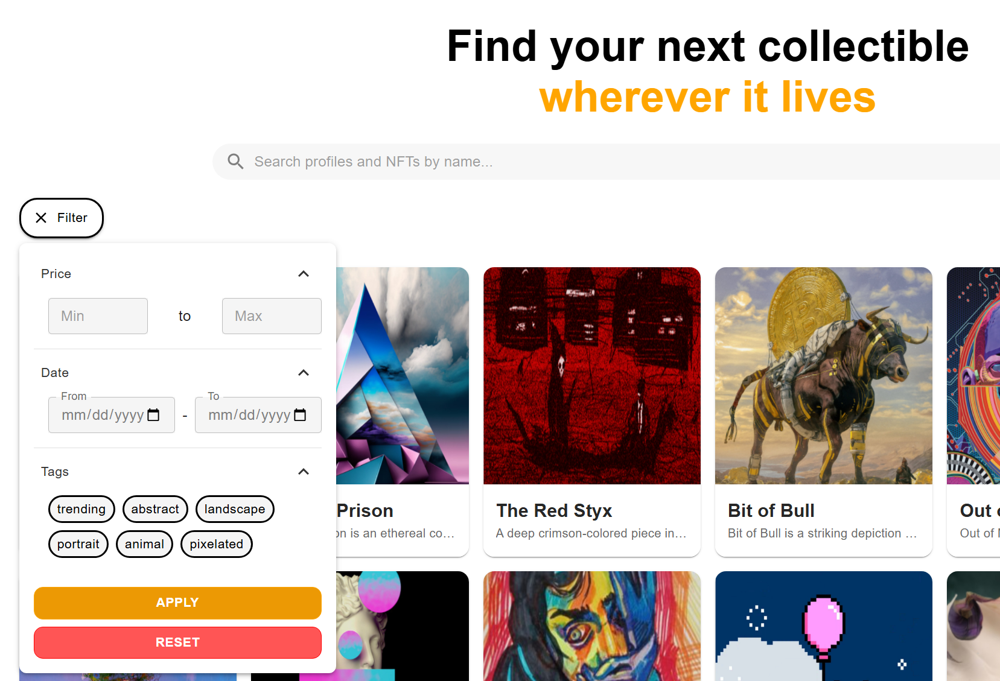
3. **Select NFT**: Click on the NFT you want to bid on, a modal will appear, allow you enter your offer.
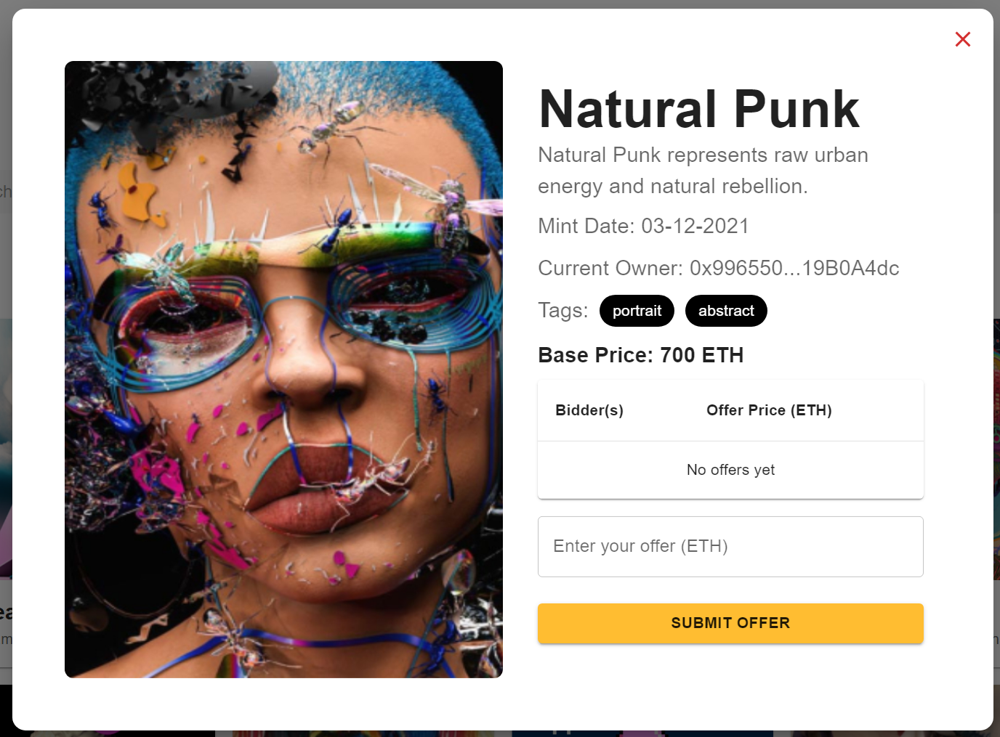
4. **Bid Successfully**: After submit your bid, you can see it in tab `Bidding` in page `Profiles`. Click on the bid allow you to see current offer and update your offer if wanted.
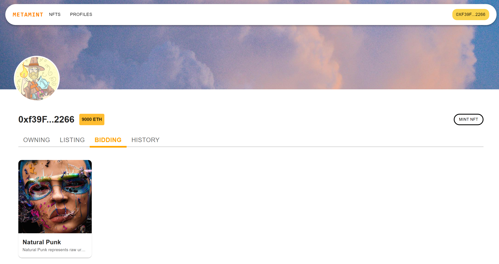
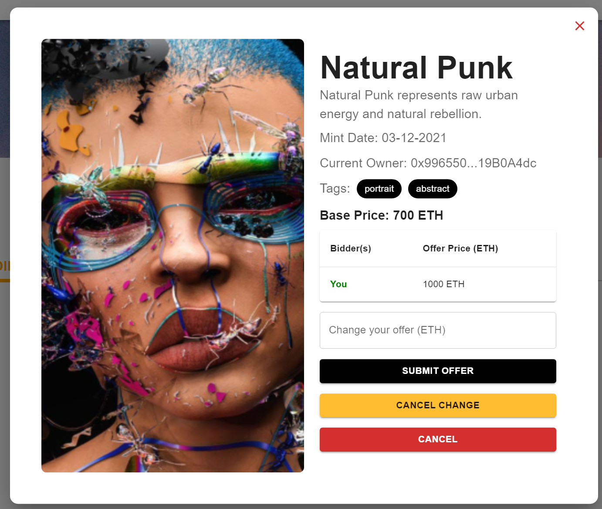

### 3. List an NFT to Market
1. **Access your owning Nfts**: Go to tab `Owning` in page `Profiles`. Here, you can see all Nfts you are owning that are not listed. Simply click on your wanted Nft, enter a base price and submit the listing. Once an Nft is listed, you can't see it in tab `Owning` anymore.
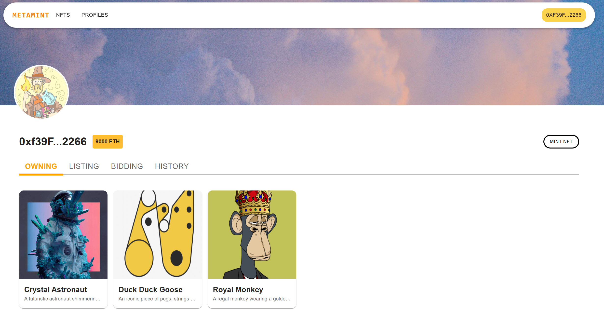
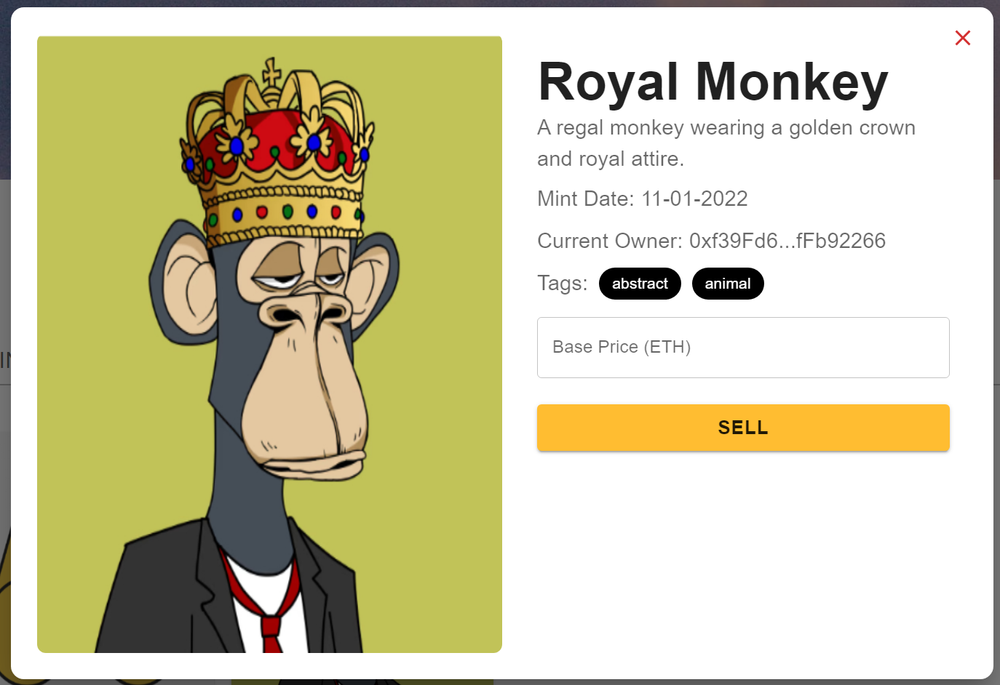
2. **List successfully**: Go to tab `Listing` to manage your listed Nfts. Click on each Nft allows you to see current offers and accept the offer you want. Once you accept an offer, this Nft will be transfered to the buyers.
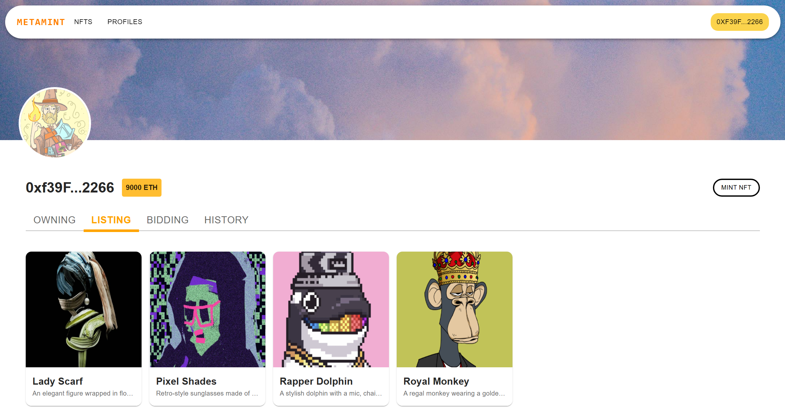
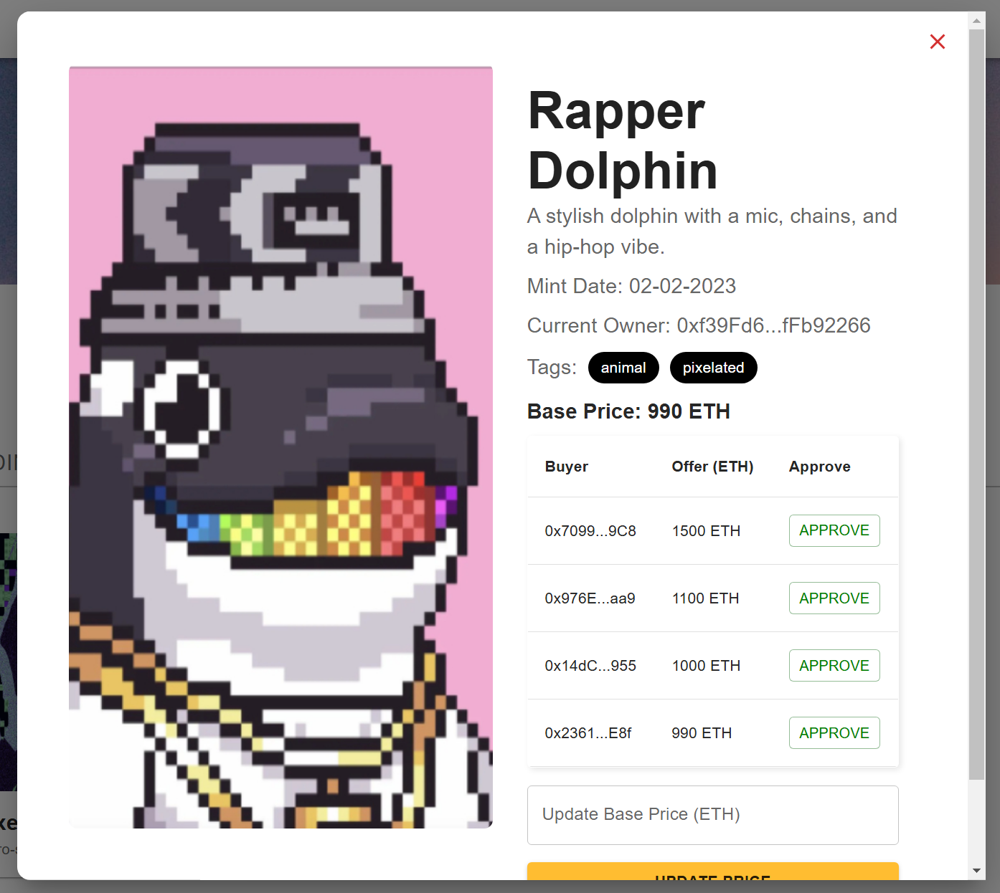

### 4. See Transaction History
**Browser transaction history**: Go to tab `History` in page `Profiles`. Here, you can see a table with a list of all trades current user previously made. Currently, they are all dummy data. Click on the NFT name allows you to see details of this NFT.
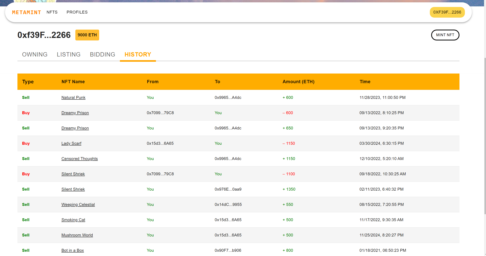
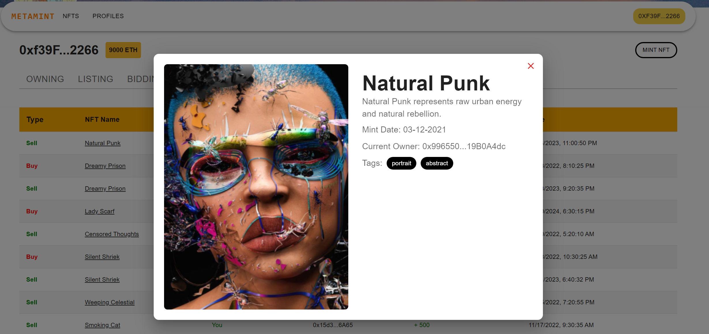

### 5. Mint New NFT
1. **Mint new NFT**: In page `Profiles`, click on button `Mint Nft` to open a modal for minting new NFT.
2. **Fill details**: Upload the file you want to mint as an NFT as well as its metadata. Once these data are valid, click submit and you will see an alert notify the details of newly minted NFT. This function will be implemented further in Assignment 2 when we work with database and backend.
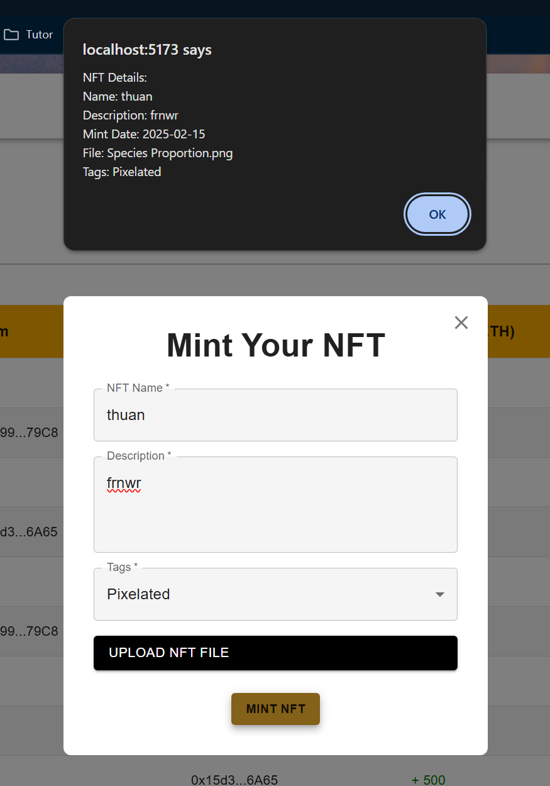
